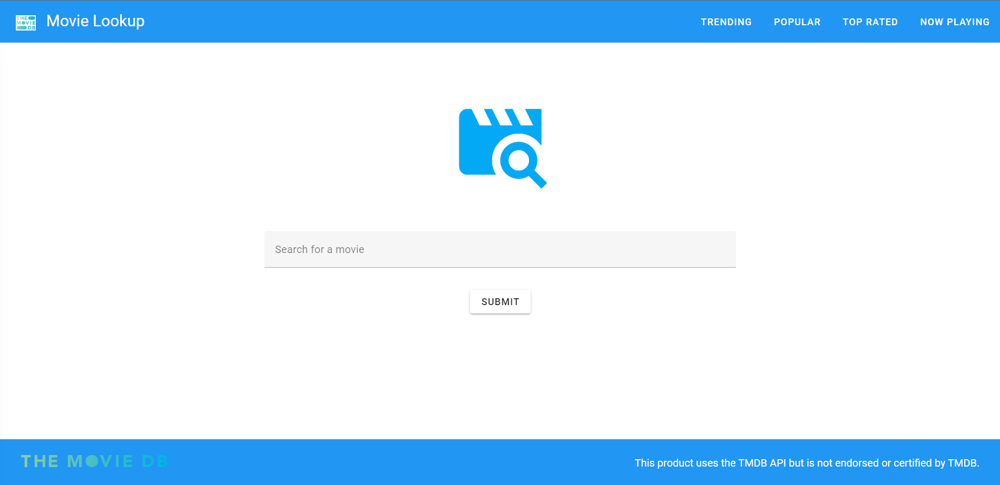
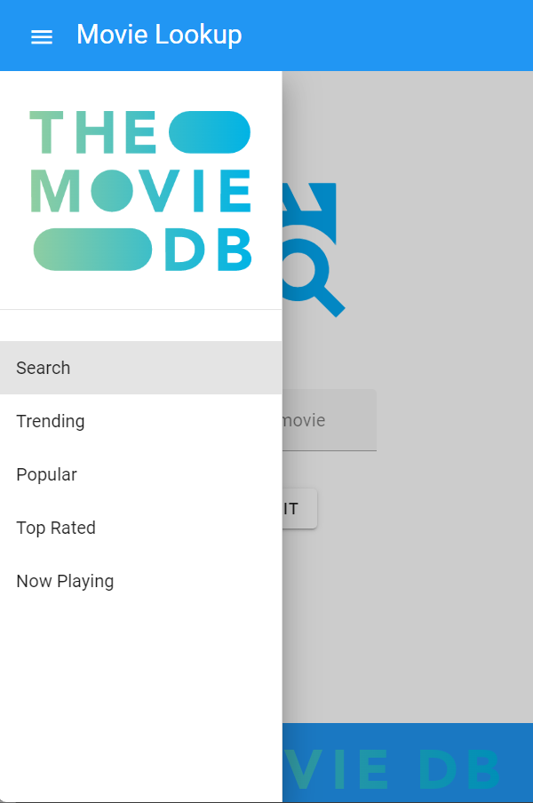

  # Vuetify Movie Lookup
  [](https://opensource.org/licenses/MIT)</br></br>
    
  This application This application uses Vuetify and the TMDB API to host a simple movie search application. Users can search for movies by name, view extended details for a specific movie, view recommended and similar movies to search results, and view trending, popular, top-rated, and now-playing films.
  
  ## Table of Contents
  
  * [Installation](#installation)
  * [Built With](#built)
  * [Usage Information](#usage)
  * [Authors & Acknowledgements](#credits)
  * [License](#license)
  * [Contact](#questions)
  
  ## Installation<a name="installation"></a>
  For local use, after cloning, create a .env file containing your TMDB api key, then type "npm run serve" to start the server. This application is also available at the live link.

  ## Built With<a name="built"></a>
  * Vue 3
  * Vite
  * Vue Router
  * Vuetify
  * Axios
  * Render (deploy)
  
  ## Usage Information<a name="usage"></a>
  [Vuetify Movie Lookup](https://vuetify-movie-lookup.onrender.com/)</br>
    
  This application is a simple movie search website.</br>
  </br></br>
  </br></br>
    
  ## Authors & Acknowledgements<a name="credits"></a>
  Special thanks to the following resources:

  Mamadou's answer [here](https://stackoverflow.com/questions/62561821/how-to-hide-menu-items-based-on-vuetify-breakpoint) on how to conditionally hide or show Vue elements based on breakpoints</br>
  Uatar's answer [here](https://stackoverflow.com/questions/59255192/breakpoints-not-working-correctly-for-xs-in-vuetify) on why xs breakpoints weren't working</br>
  Mfrontera's answer [here](https://stackoverflow.com/questions/76212493/vuetify-3-v-form-submitting-even-if-not-valid) on how to incorporate validation rules on submission of forms</br>

  This product uses the TMDB API but is not endorsed or certified by TMDB.
  
  Made by [TOVTC](https://github.com/TOVTC).
  
  ## License<a name="license"></a>
  This application uses the MIT License. For more information regarding usage, please visit [this link](https://opensource.org/licenses/MIT).

<<<<<<< HEAD
  ## Questions?<a name="questions"></a>
  Contact repository author via [GitHub](https://github.com/TOVTC).</br>
=======
## Project setup

```
# yarn
yarn

# npm
npm install

# pnpm
pnpm install
```

### Compiles and hot-reloads for development

```
# yarn
yarn dev

# npm
npm run dev

# pnpm
pnpm dev
```

### Compiles and minifies for production

```
# yarn
yarn build

# npm
npm run build

# pnpm
pnpm build
```

### Lints and fixes files

```
# yarn
yarn lint

# npm
npm run lint

# pnpm
pnpm lint
```

### Customize configuration

See [Configuration Reference](https://vitejs.dev/config/).

<!-- https://stackoverflow.com/questions/59255192/breakpoints-not-working-correctly-for-xs-in-vuetify -->
<!-- why is my breakpoint not working lmao -->

<!-- https://stackoverflow.com/questions/76212493/vuetify-3-v-form-submitting-even-if-not-valid -->
<!-- incorporating validation on form submission -->

<!-- https://stackoverflow.com/questions/62561821/how-to-hide-menu-items-based-on-vuetify-breakpoint -->
<!-- visibility according to breakpoints -->
>>>>>>> 157ff4742a97f2dcf31b5243e3ee839ae1224cda
